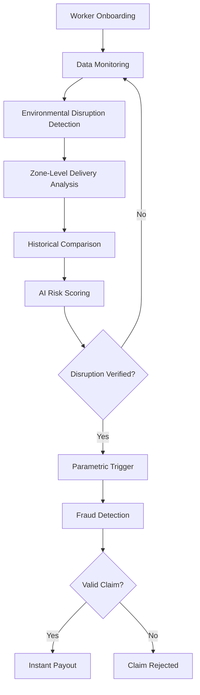

# 🛡️ GigShield

### AI-Powered Parametric Insurance for Gig Workers

[](LICENSE)
[]()
[]()

---

## 📋 Table of Contents

- [Overview](#-overview)
- [Problem Statement](#-problem-statement)
- [Our Solution](#-our-solution)
- [Key Features](#-key-features)
- [System Workflow](#-system-workflow)
- [Data Sources](#-data-sources)
- [Competitive Advantage](#-competitive-advantage)
- [Expected Impact](#-expected-impact)
- [Future Enhancements](#-future-enhancements)

---

## 🌟 Overview

**GigShield** is an AI-powered parametric insurance platform designed to protect gig economy delivery workers from income loss caused by external disruptions.

### The Challenge

Delivery partners on platforms like **Swiggy**, **Zomato**, **Amazon**, and **Zepto** depend on daily deliveries for their livelihood. Their income is vulnerable to uncontrollable external conditions:

- 🌡️ **Extreme heat**
- 🌧️ **Heavy rainfall**
- 💨 **Air pollution**
- 🚦 **Traffic congestion**
- 📱 **Platform downtime**
- 🚫 **Curfews or zone restrictions**

These disruptions reduce delivery orders and working hours, causing **direct income loss** for gig workers.

### Our Approach

GigShield introduces a **parametric insurance system powered by AI** that automatically detects disruption events and provides **instant payouts** when income loss is verified.

> **⚠️ Important:** GigShield covers **income loss only**. It does NOT cover health insurance, accidents, vehicle repairs, or medical expenses.

---

## 🚨 Problem Statement

### The Gig Worker Dilemma

Gig workers operate under an "independent contractor" model, lacking traditional employment benefits:

| ❌ Missing Benefits | 📉 Impact |
|---------------------|-----------|
| Stable wages | Income uncertainty |
| Job security | No safety net |
| Social protection | Financial vulnerability |
| Income protection | 20-30% weekly income loss during disruptions |

### Key Challenges

- 💸 Irregular wages
- ⏰ Uncertain work availability
- 🤖 Algorithm-based performance pressure
- 🏥 Lack of social security coverage
- 🌍 Limited protection during environmental disruptions

Despite policy initiatives like the **Code on Social Security 2020**, practical mechanisms for real-time income protection remain limited.

---

## 💡 Our Solution

GigShield is an **AI-driven parametric insurance platform** that:

```
✅ Provides weekly insurance coverage to delivery workers
✅ Monitors real-time environmental and operational data
✅ Uses AI models to detect income disruption risk
✅ Automatically triggers insurance claims when disruption occurs
✅ Instantly transfers payouts to workers
```

**Fast. Automated. Fair.** No manual claim submissions required.

---

## 🔑 Key Features

### 1. 🤖 AI-Powered Risk Assessment

An AI model evaluates environmental and operational factors to calculate a **disruption risk score**.

**Input Factors:**
- Temperature
- Rainfall
- Air Quality Index (AQI)
- Traffic congestion
- Delivery demand
- Platform availability

**Output:**
- Disruption risk score (0-1)
- Risk category: `LOW` | `MEDIUM` | `HIGH`

**Used For:**
- Weekly premium pricing
- Disruption alerts
- Insurance trigger eligibility

---

### 2. 📍 Zone-Adaptive Disruption Thresholds

Environmental conditions vary significantly between cities and zones. GigShield uses **historical zone data** to determine dynamic disruption thresholds.

**Example Thresholds:**

| Zone | Factor | Threshold |
|------|--------|-----------|
| Urban metro zone | Traffic index | 0.90 |
| Small city zone | Traffic index | 0.65 |
| Coastal zone | Rainfall | 120 mm |
| Dry region | Rainfall | 40 mm |

> 💡 Thresholds are dynamically adjusted based on historical disruption patterns and delivery activity data.

---

### 3. ✅ Context-Aware Parametric Trigger System

Traditional parametric insurance can trigger false payouts. GigShield uses **two-layer verification**:

#### **Layer 1: Environmental Trigger** 🌍

```python
temperature > zone_threshold
rainfall > zone_threshold
AQI > zone_threshold
traffic_index > zone_threshold
platform_status == "down"
```

#### **Layer 2: Delivery Activity Validation** 📦

Even if conditions are extreme, the system verifies whether delivery activity actually dropped.

**Metrics Analyzed:**
- Deliveries per hour
- Active delivery partners
- Order demand
- Acceptance rate

✅ **Disruption confirmed** only if delivery activity decreases significantly compared to historical data.

---

### 4. 🔒 Intelligent Fraud Detection

Multiple verification layers prevent fraudulent claims:

| Check | Purpose |
|-------|---------|
| Weather data verification | Confirm disruption occurred |
| GPS location validation | Confirm worker location |
| Platform activity analysis | Detect fake inactivity |
| Duplicate claim detection | Prevent multiple claims |

**Example Rule:**
```
IF claim_reason == "rain"
   AND rainfall < threshold
THEN fraud_flag = TRUE
```

---

### 5. ⚡ Automated Claim Processing & Instant Payouts

When a disruption event is confirmed:

1. ✅ Claim automatically generated
2. ✅ Worker eligibility verified
3. ✅ Estimated income loss calculated
4. ✅ Payout instantly transferred

**Payment Integration:**
- Razorpay (sandbox)
- Stripe (sandbox)

---

## 🔄 System Workflow



### Step-by-Step Process

1. **Worker Onboarding** - Delivery partners register and select a weekly insurance plan
2. **Data Monitoring** - System continuously collects real-time environmental and platform data
3. **Environmental Disruption Detection** - AI detects potential disruption events based on zone-specific thresholds
4. **Zone-Level Delivery Analysis** - Delivery activity in the worker's zone is analyzed
5. **Historical Comparison** - Current delivery metrics are compared with historical averages
6. **AI Risk Scoring** - AI calculates disruption probability
7. **Parametric Trigger Decision** - If disruption is verified, a claim is automatically initiated
8. **Fraud Detection** - Location and activity checks validate the claim
9. **Instant Payout** - Worker receives compensation automatically

---

## 📊 Data Sources

### 🌍 Environmental Data
- Weather APIs (rainfall, temperature)
- AQI data
- Pollution levels

### 🚗 Operational Data
- Traffic congestion index
- Delivery demand
- Active riders

### 📱 Platform Data (Simulated)
- Order volume
- Delivery acceptance rate
- Platform uptime

---

## 🏆 Competitive Advantage

### Existing Solutions

Parametric insurance exists in:
- 🌾 Agriculture insurance
- 🌪️ Natural disaster insurance
- 🌍 Climate risk protection

**Limitations:**
- Trigger payouts based on **single environmental thresholds**
- Do NOT consider platform activity or worker income patterns
- Existing gig worker income protection covers illness, disability, unemployment
- Do NOT address environment-based income disruptions

### How GigShield is Different

| Feature | Traditional Parametric Insurance | GigShield |
|---------|----------------------------------|-----------|
| Trigger mechanism | Single threshold | Two-layer verification |
| Threshold type | Fixed | Zone-adaptive |
| Activity validation | ❌ No | ✅ Yes |
| Fraud detection | Basic | Multi-layer AI-powered |
| Payment cycle | Monthly/Annual | Weekly micro-insurance |
| AI integration | ❌ Limited | ✅ Core feature |

**Key Innovations:**

1. 🤖 **AI-Driven Disruption Verification** - Machine learning analyzes environmental and operational signals
2. 📍 **Zone-Adaptive Thresholds** - Dynamically adjust based on historical conditions
3. 📦 **Delivery Activity Validation** - Environmental triggers must correspond to actual drops in delivery demand
4. 🔒 **Automated Fraud Detection** - Multiple validation layers ensure accurate and fair payouts
5. 💰 **Weekly Micro-Insurance Model** - Matches the weekly earnings cycle of gig workers

---

## 🎯 Expected Impact

GigShield can:

- 💪 **Reduce financial instability** for gig workers
- ⚡ **Provide rapid support** during disruptions
- 🤝 **Increase trust** in platform work ecosystems
- 🌍 **Promote inclusive financial protection** in the gig economy

---

## 🚀 Future Enhancements

Potential features on the roadmap:

- 🔮 **Predictive disruption alerts** - Warn workers before disruptions occur
- 🎯 **AI-based premium personalization** - Customized pricing based on individual risk profiles
- 🏛️ **Government welfare integration** - Connect with social security programs
- 📊 **Worker analytics dashboards** - Insights into earnings and disruption patterns
- 🤝 **Platform partnerships** - Direct integration with delivery platforms

---

## 📄 License

This project is licensed under the MIT License - see the [LICENSE](LICENSE) file for details.

---

## 🤝 Contributing

Contributions, issues, and feature requests are welcome!

---

## 📧 Contact

For questions or support, please reach out to the GigShield team.

---

## 🚀 Implementation Status

**✅ COMPLETE** - Full backend implementation with:
- 46 REST API endpoints
- 8 database models
- 2 ML models (XGBoost + Isolation Forest)
- 6 service classes
- Complete documentation
- Ready for local + production deployment

### 📁 What's Included
```
├── backend/              FastAPI backend
├── QUICKSTART.md        5-minute local setup guide
├── API_REFERENCE.md     Complete API documentation
├── ARCHITECTURE.md      System design details
├── IMPLEMENTATION.md    Implementation details
└── INDEX.md            Complete project index
```

### ⚡ Quick Start
```bash
cd backend
python -m venv venv
source venv/bin/activate  # Windows: venv\Scripts\activate
pip install -r requirements.txt
cp .env.example .env
# Edit .env with PostgreSQL password
python run.py
# API: http://localhost:8000/docs
```

👉 **[View Implementation Guide](IMPLEMENTATION.md)** | **[Quick Start](QUICKSTART.md)** | **[API Reference](API_REFERENCE.md)**

---

<div align="center">

**Built with ❤️ for gig workers**

⭐ Star this repo if you support fair income protection for gig workers!

</div>
