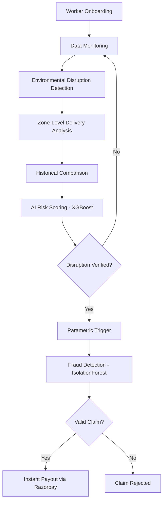

# Carely  
### *"An Insurance that truly cares"*  
> A Insurance Solution for Gig workers in guidance of Guidewire

---
## Institution Name  
Sri Eshwar College of Engineering  

---
## Team Details  
- **Team Name:** AG6  
- **Team Leader:** Reegan Ferdinand  

### Team Members  
- Suryaprakash S  
- Srivarshan R  
- Tamilselvan P
  
---
## 📋 Table of Contents
- [Overview](#-overview)
- [Problem](#-problem)
- [Our Solution](#-our-solution)
- [Tech Stack](#-tech-stack)
- [Project Structure](#-project-structure)
- [Key Features](#-key-features)
- [System Workflow](#-system-workflow)
- [API Reference](#-api-reference)
- [Data Sources](#-data-sources)
- [Competitive Advantage](#-competitive-advantage)
- [Expected Impact](#-expected-impact)
- [Running Locally](#-running-locally)
- [Future Plans](#-future-plans)
- [License](#-license)
- [Contact](#-contact)

---

Video Pitch link - https://drive.google.com/drive/folders/1NAUF1Ty0_cNgpx7Oqu7h4SO5_mY7TxAw?usp=drive_link

---

## Overview

Imagine a delivery partner starting their day.

They log in, ready to earn.

But suddenly:
- 🌧️ Heavy rain starts  
- 🔥 Extreme heat slows movement  
- 📱 App goes down  
- 🚦 Traffic blocks deliveries  

At the end of the day — **less work, less income.**

Not their fault. No safety net.

**Carely exists to solve this.**

---

## Problem

Gig workers:
- Don't have stable income
- Don't have insurance for income loss
- Are affected by real-world disruptions daily

Even one bad day can mean loss of essential daily earnings. There is **no system today that protects their income in real-time.**

---

## 💡 Our Solution

**Carely** is a **parametric insurance platform** designed for gig workers. It:

- Monitors real-world conditions continuously
- Detects disruptions automatically using AI
- Verifies income impact through two-layer validation
- Instantly provides payouts via Razorpay

No paperwork. No claims process. Just **automatic support when needed.**

---

## 🛠️ Tech Stack

### Frontend
| Technology | Purpose |
|---|---|
| React 18 + TypeScript | UI framework |
| Vite | Build tool |
| Tailwind CSS | Styling |
| Zustand | State management |
| Recharts | Dashboard charts |
| Axios | HTTP client |
| React Router v6 | Client-side routing |

### Backend
| Technology | Purpose |
|---|---|
| FastAPI | REST API framework |
| SQLAlchemy | ORM |
| SQLite (dev) / PostgreSQL (prod) | Database |
| Pydantic v2 | Request/response validation |
| XGBoost | Disruption risk scoring |
| scikit-learn IsolationForest | Fraud detection |
| Razorpay SDK | Payment processing |
| httpx | Async HTTP for integrations |

---

## 📁 Project Structure

```
GigShield/
├── frontend/
│   └── src/
│       ├── api/          # Axios API client
│       ├── components/   # Navbar, Footer
│       ├── pages/        # HomePage, WorkerPortal, AdminDashboard, ClaimsPage
│       ├── stores/       # Zustand state (auth + data)
│       └── types/        # TypeScript interfaces
│
└── backend/
    └── app/
        ├── api/          # FastAPI routes
        ├── core/         # Config & settings
        ├── database/     # SQLAlchemy session
        ├── integrations/ # Weather, Delivery, Payment clients
        ├── ml/           # XGBoost + IsolationForest models
        ├── models/       # ORM models (DB tables)
        ├── schemas/      # Pydantic schemas
        └── services/     # Business logic layer
```

---

## 🔑 Key Features

### 1. 🤖 AI-Powered Risk Assessment
An XGBoost model evaluates environmental and operational factors to calculate a **disruption risk score**. Falls back to rule-based scoring when not yet trained.

**Input Factors:** Temperature · Rainfall · AQI · Traffic index · Delivery demand · Zone

**Output:** Risk score (0–1) · Risk level `LOW` / `MEDIUM` / `HIGH` · Triggering factors

---

### 2. 📍 Zone-Adaptive Disruption Thresholds
Thresholds are not fixed — they adapt per zone based on historical patterns.

| Zone | Factor | Threshold |
|---|---|---|
| Urban metro | Traffic index | 0.90 |
| Small city | Traffic index | 0.65 |
| Coastal zone | Rainfall | 120 mm |
| Dry region | Rainfall | 40 mm |

---

### 3. ✅ Two-Layer Parametric Trigger System

**Layer 1 — Environmental Trigger**
```python
temperature   > zone_threshold  OR
rainfall      > zone_threshold  OR
aqi           > zone_threshold  OR
traffic_index > zone_threshold
```

**Layer 2 — Delivery Activity Validation**  
Even if conditions are extreme, the system confirms delivery activity actually dropped before triggering a claim.

Disruption is confirmed only when **both layers** pass.

---

### 4. 🔒 Intelligent Fraud Detection
IsolationForest + rule-based checks run on every claim:

| Check | Fraud Signal |
|---|---|
| Claim frequency | > 3 claims in 30 days |
| Weather verification | Disruption must be confirmed |
| GPS validation | Worker must be in affected zone |
| Activity consistency | Abnormal inactivity patterns |
| Claim amount deviation | > 2 std dev from worker's history |
| Early claim | Claimed within 3 days of subscribing |

Fraud threshold: `0.75` — claims above this are auto-rejected.

---

### 5. ⚡ Automated Claim Processing & Instant Payouts

When a disruption is confirmed:
1. Claim automatically generated
2. Fraud detection runs (IsolationForest + rules)
3. Claim verified or rejected
4. Approved claim triggers Razorpay payout instantly

**Insurance Plans:**

| Plan | Duration | Premium | Max Payout |
|---|---|---|---|
| DAILY | 1 day | ₹5 | ₹200 |
| WEEKLY | 7 days | ₹25 | ₹500 |
| MONTHLY | 30 days | ₹120 | ₹2000 |

---

### 6. 📊 Admin Dashboard
Real-time stats pulled live from the backend:
- Total workers, active subscriptions, total claims, fraud detected
- Monthly trends bar chart
- Claims distribution pie chart
- Claims trend line chart

---

## 🔄 System Workflow



### Step-by-Step

1. **Worker Onboarding** — Register and subscribe to a Daily / Weekly / Monthly plan
2. **Data Monitoring** — System collects real-time weather, AQI, traffic, and delivery data
3. **Environmental Detection** — AI checks if conditions crossed zone-specific thresholds
4. **Delivery Analysis** — Delivery activity in the worker's zone is analyzed
5. **Historical Comparison** — Current metrics compared against historical averages
6. **AI Risk Scoring** — XGBoost calculates disruption probability (0–1)
7. **Parametric Trigger** — If both layers confirm disruption, claim is auto-initiated
8. **Fraud Detection** — IsolationForest + rules validate the claim
9. **Instant Payout** — Worker receives compensation via Razorpay

---

## 📡 API Reference

Base URL: `http://localhost:8000/api/v1`  
Interactive docs: `http://localhost:8000/docs`

| Method | Endpoint | Description |
|---|---|---|
| POST | `/workers` | Register a new worker |
| GET | `/workers` | List all workers |
| GET | `/workers/{id}` | Get worker details |
| POST | `/subscriptions` | Subscribe to a plan |
| GET | `/subscriptions/worker/{id}` | Get active subscription |
| GET | `/subscriptions/worker/{id}/coverage` | Check coverage status |
| POST | `/risk/assess` | Run AI risk assessment |
| POST | `/environmental-data` | Record zone environmental data |
| GET | `/environmental-data/{zone}` | Get zone data history |
| POST | `/claims` | Create a claim |
| GET | `/claims` | List all claims |
| GET | `/claims/worker/{id}` | List worker's claims |
| POST | `/claims/{id}/verify` | Run fraud detection on claim |
| POST | `/claims/{id}/approve` | Approve claim for payout |
| POST | `/payouts` | Initiate payout |
| POST | `/payouts/{id}/complete` | Mark payout as completed |
| GET | `/stats` | Get dashboard statistics |
| GET | `/health` | Health check |

---

## 📊 Data Sources

### Environmental
- OpenWeatherMap API — rainfall, temperature, wind
- Air Pollution API — AQI (converted to 0–500 scale)

### Operational
- Traffic congestion index
- Delivery demand relative to baseline
- Active riders count

### Platform Data (Simulated)
- Zomato, Swiggy, Uber aggregated delivery metrics
- Order volume, acceptance rate, average delivery time

---

## 🏆 Competitive Advantage

| Feature | Traditional Parametric Insurance | Carely |
|---|---|---|
| Trigger mechanism | Single threshold | Two-layer verification |
| Threshold type | Fixed | Zone-adaptive |
| Activity validation | No | Yes |
| Fraud detection | Basic | Multi-layer AI (IsolationForest) |
| Payment cycle | Monthly / Annual | Daily / Weekly / Monthly |
| AI integration | Limited | Core — XGBoost + IsolationForest |
| Real-time monitoring | No | Yes |
| Platform integration | No | Zomato, Swiggy, Uber (simulated) |

---

## 🎯 Expected Impact

- Reduce financial instability for gig workers
- Provide rapid support during real-world disruptions
- Increase trust in platform work ecosystems
- Promote inclusive financial protection in the gig economy

---

## 🚀 Running Locally

### Backend
```bash
cd backend
pip install -r requirements.txt
python run.py
# API running at http://localhost:8000
# Docs at http://localhost:8000/docs
```

### Frontend
```bash
cd frontend
npm install
npm run dev
# App running at http://localhost:5173
```

> Backend must be running before starting the frontend. The frontend `.env` points to `http://localhost:8000/api/v1` by default.

---

## 🔮 Future Plans

### Authentication & User Management
- JWT-based login and registration flow
- Worker profile management
- Role-based access (worker vs admin)

### Real Platform Integrations
- Live Zomato, Swiggy, Uber API connections (currently simulated)
- Real-time GPS tracking for location verification
- Platform uptime monitoring

### ML Model Improvements
- Train XGBoost on real historical disruption datasets
- Retrain IsolationForest with actual fraud patterns
- Add model versioning and A/B testing
- Introduce time-series forecasting for proactive alerts

### Payment & Payout
- Move Razorpay from sandbox to production
- Add UPI direct payout support
- Automated payout scheduling

### Infrastructure
- Migrate from SQLite to PostgreSQL in production
- Add Redis caching for real-time data
- Celery background tasks for continuous zone monitoring
- Docker Compose full-stack deployment
- CI/CD pipeline with GitHub Actions

### Worker Experience
- Push notifications for disruption alerts
- Mobile-responsive PWA
- Multi-language support (Tamil, Hindi, English)
- Earnings analytics dashboard for workers

### Compliance & Scale
- IRDAI regulatory compliance framework
- Multi-city zone configuration
- Audit logs for all claim decisions
- Data export for regulatory reporting

---

## 📄 License
This project is licensed under the MIT License - see the LICENSE file for details.

---

## 🤝 Contributing
Contributions, issues, and feature requests are welcome!

---

## 📧 Contact
For questions or support, please reach out to the Carely Team  
- suryapr.exe14@gmail.com  
- carelycustomersupport@gmail.com *(coming soon)*
